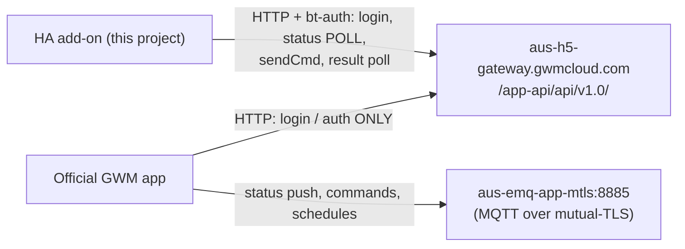
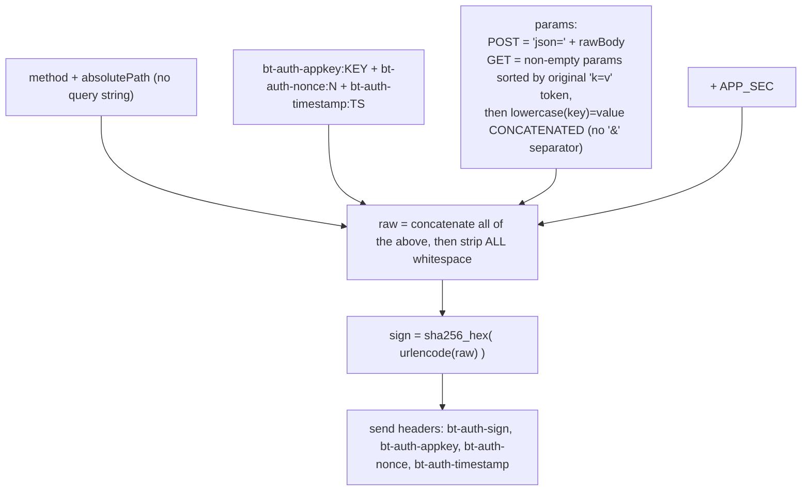
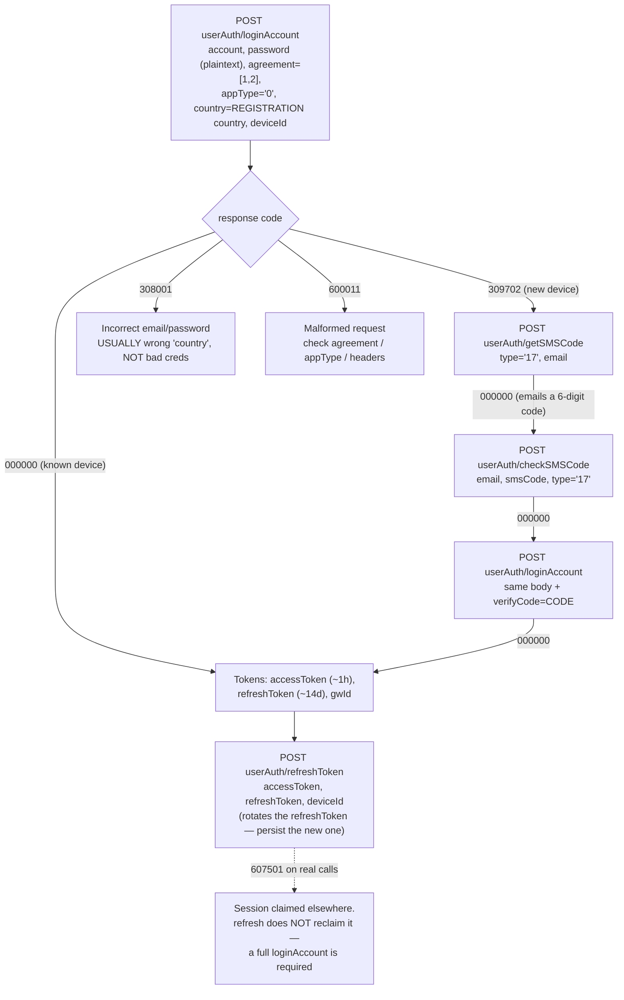
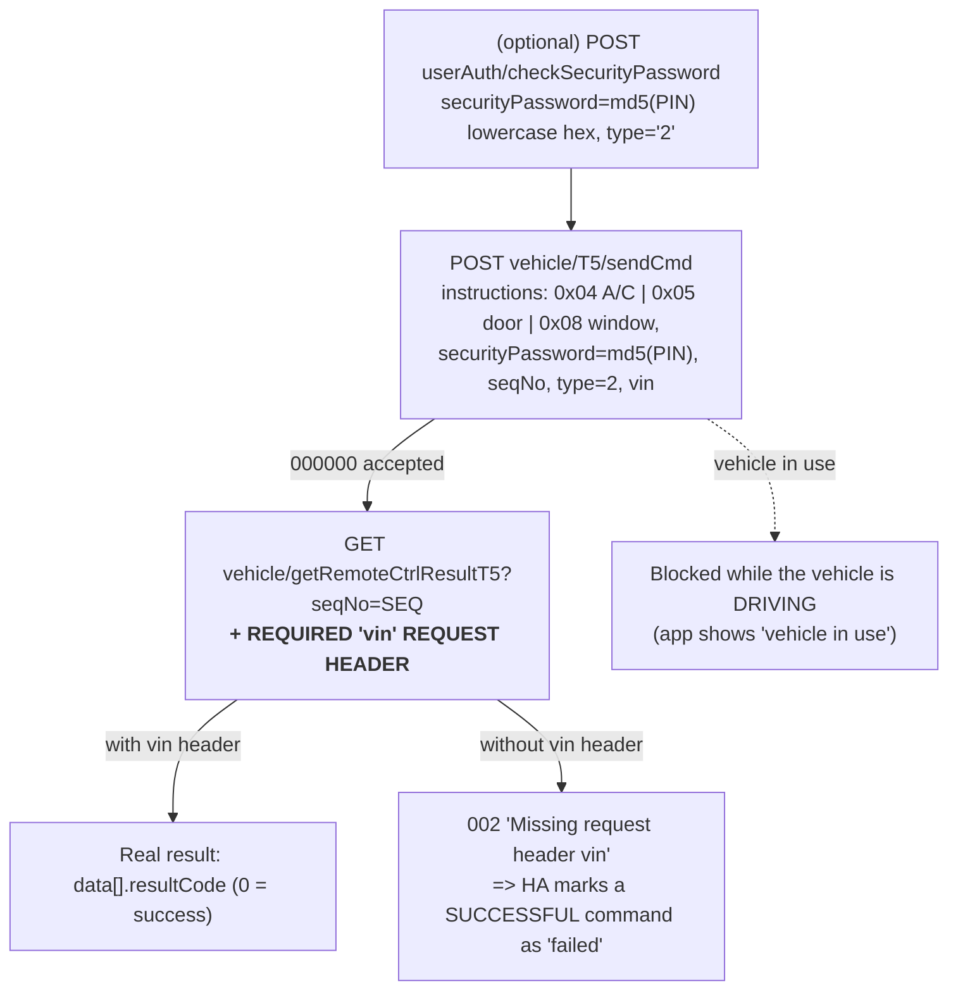

# GWM ANZ (Australia / New Zealand) API — Developer Notes

Reverse-engineered notes for the **`aus`** region of the GWM cloud API used by this add-on.
**Start here** if AU/NZ authentication breaks or you're extending AU support.

> ⚠️ **EU is fundamentally different.** EU authenticates with a **mutual-TLS client
> certificate** and different endpoints. The `aus` region uses **`bt-auth` request signing**
> instead and talks only to `aus-h5-gateway`. Almost nothing below applies to EU.

---

## AU vs EU at a glance

Both regions share the *command payloads* (`0x04`/`0x05`/`0x08`) and status item codes, but
differ in transport and auth. The rows below are taken directly from the add-on code
(`GwmApiClient.cs`); the detailed EU auth **sequence** is intentionally not documented here
(see note).

| | EU (`eu`) | AU / NZ (`aus`) |
|---|---|---|
| **Auth** | mutual-TLS **client certificate** | **`bt-auth`** request signing (SHA-256) |
| **Gateway host(s)** | `eu-h5-gateway` + `eu-app-gateway` | `aus-h5-gateway` only (`app-gateway` is dead) |
| **Terminal / brand** | `GW_APP_ORA` / `3` | `GW_APP_Haval` / `1` |
| **Device id** | sent in the request **body** | sent as **`deviceId` + `iccid`** headers |
| **`language` / `cVer`** | `en` / `""` | `en_US` / `1.0.0` |
| **`regionCode` header** | — | `regionCode` = `country` |
| **Numeric JSON fields** | strict | lenient (`AllowReadingFromString` — AU returns some numbers as strings) |

> **EU flow diagrams are intentionally omitted.** This document is built from *verified* AU/NZ
> reverse-engineering; the author has no EU account to verify against, and EU recently moved to
> a new "v2" authentication method. The EU sequence should be documented by someone who can
> confirm it.

---

## 1. Big picture — what talks over what

The official app and this add-on reach the **same gateway** but use it very differently.

**Key consequence:** the app does status/commands/**charging** over **MQTT**, which the
HTTP add-on cannot see or speak. The add-on works because the gateway *also* exposes an HTTP
surface (`sendCmd`, `getLastStatus`, …) — but only for the features implemented in code.
The `app-gateway` host used by EU is **dead** on AU (connection refused); everything is on
`h5-gateway`.

---

## 2. Request signing (`bt-auth`)

Every AU call must carry a valid `bt-auth` signature or the gateway returns **`607099`
"sign is inconformity"**.

**GET signing is the subtle part** (this bit the project twice):
- Drop **empty** query params from both the URL *and* the signature
  (e.g. `getLastStatus?vin=X&seqNo=` signs and sends as `vin=X`).
- Sort the remaining params by their **original `key=value` token** (ordinal).
- In the signed string, **lowercase each key** and **concatenate pairs with no separator**
  — e.g. `seqNo=ABC` signs as `seqno=ABC`, and `flag=true&vin=X` signs as `flag=truevin=X`.
- The **outgoing URL** keeps the normal `&`-joined, original-case query.

This is why `vin=…` worked but `seqNo=…` (capital N) failed until the rule was fixed —
`vin` is already lowercase, so it signed identically either way.

Reference implementation: [`BtAuthSigningHandler.cs`](../src/LibGwmApi/BtAuthSigningHandler.cs).

---

## 3. Login flow

Plaintext password (RSA/`isEncrypt` was a red herring). The `country` **must be the
account's registration country** (e.g. `NZ`), not necessarily `AU`.

**Single session per account.** A fresh `loginAccount` anywhere supersedes all other
sessions; `refreshToken` renews the token but does **not** reclaim a superseded session
(you get `607501` on real calls). Dedicate one account to the add-on.

Token-**exempt** (pre-login) endpoints: `loginAccount`, `loginWithSMS`, `withdrawAtLogin`,
`tripartiteLogin`. Everything else needs the `accessToken` header (else `607124`).

---

## 4. Remote commands

Notes:
- `seqNo` format = `uuid.hex + "1234"`. PIN is `md5(pin)` **lowercase hex**.
- The **`vin` header** on the result poll is a *header*, not a signed query param, so it does
  not affect the signature. It's the encoded VIN (same value as the `vin=` query on
  `getLastStatus`). Missing it is the cause of "commands show as failed".
- A/C **on** actuates reliably; A/C **off** via the same `0x04` `switchOrder:"0"` payload has
  not reliably flipped in testing (open item — the app's exact off-payload is unconfirmed).
- Wrong PIN → `308026` with an attempts countdown (~5 → lockout). Enter carefully.

---

## 5. Charging (the solar-charging question)

- The ANZ app exposes an instant **"Charge now"** toggle (only when plugged in) and a
  **Charging Schedule** (enable + start/stop + repeat).
- **Both go over MQTT**, confirmed with a working HTTP proxy: setting a schedule produced
  **zero** HTTP; only the initial `loginAccount` is HTTP. Status, commands and schedules are
  all MQTT.
- There is **no charging instruction in the HTTP `sendCmd` surface** that anyone has found
  (`0x04`/`0x05`/`0x08` only; EU has no charge command either), and community tools
  (`ora2mqtt`, `evcc`) are read-only.
- **Conclusion:** car-side charging control is not reachable from the HTTP add-on without
  MQTT interception (hard: mutual-TLS on 8885) or blind `sendCmd 0x??` guessing (unsafe on a
  real car). For solar-excess charging, control the **wall charger / EVSE** and read SoC from
  the add-on.

---

## 6. Error / status code reference

| Code | Meaning | Notes |
|------|---------|-------|
| `000000` | success | |
| `309702` | new device | triggers the e-mail verification sub-flow |
| `308001` | "incorrect email or password" | **usually wrong `country`** (must = registration country), not creds |
| `308011` | verification code incorrect | code wrong or expired |
| `308026` | incorrect PIN | includes "N attempts remaining"; ~5 then lockout |
| `600011` | malformed request | wrong `agreement`/`appType`/missing headers |
| `607099` | sign is inconformity | bad `bt-auth` signature — re-check the GET signing rule |
| `607124` | empty accessToken | token-gated endpoint called without the token header |
| `607501` | logged in elsewhere | single-session; refresh won't reclaim — full re-login |
| `302000` | system busy | transient GWM backend (has cleared on retry after time) |
| `002` | missing request header 'vin' | `getRemoteCtrlResultT5` needs the `vin` header |
| `250505` | execution failed | e.g. polling a bogus/unknown `seqNo` |

---

## 7. Constants & headers

- **Base:** `https://aus-h5-gateway.gwmcloud.com/app-api/api/v1.0/` (auth uses v1.0; note the
  app uses **v2.0** for some auth calls like `getVerifyCode`/`updateSecurityPassword`).
- **App key / secret:** in [`BtAuthSigningHandler.cs`](../src/LibGwmApi/BtAuthSigningHandler.cs).
- **Required headers:** `rs:2`, `terminal:GW_APP_Haval`, `brand:1`, `enterpriseId:CC01`,
  `appId:1`, `channel:APP`, `cVer:1.0.0`, `systemType:1`, `language:en_US`,
  `regionCode`=`country`, and `deviceId` == `iccid` (16 hex chars).
- **Status item codes** (from `getLastStatus` `data.items`): `2013021` SoC %, `2011501`
  range km, `2041142` charging, `2042082` plug connected, `2202001` A/C on, `2208001` lock
  (0=locked, 1=unlocked), `2101001-8` tyres.

---

## 8. Where to look in the code

| Concern | File |
|---------|------|
| `bt-auth` signing | `src/LibGwmApi/BtAuthSigningHandler.cs` |
| Region setup, hosts, headers, deserialization | `src/LibGwmApi/GwmApiClient.cs` |
| Vehicle endpoints (status, sendCmd, result) | `src/LibGwmApi/GwmApiClient.Vehicle.cs` |
| Login / SMS / refresh / security PIN | `src/LibGwmApi/GwmApiClient.UserAuth.cs` |
| Command payloads (`0x04`/`0x05`/`0x08`) | `src/LibGwmApi/DTO/Vehicle/SendCmd.cs`, `RemoteCommands/RemoteCommandFactory.cs` |
| Command orchestration + result polling | `src/GwmOra.Addon/RemoteCommands/RemoteCommandService.cs` |
